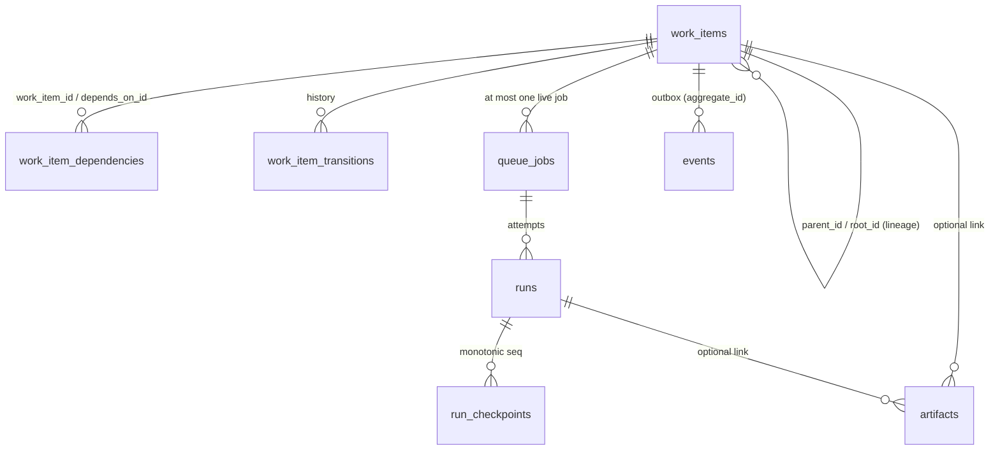
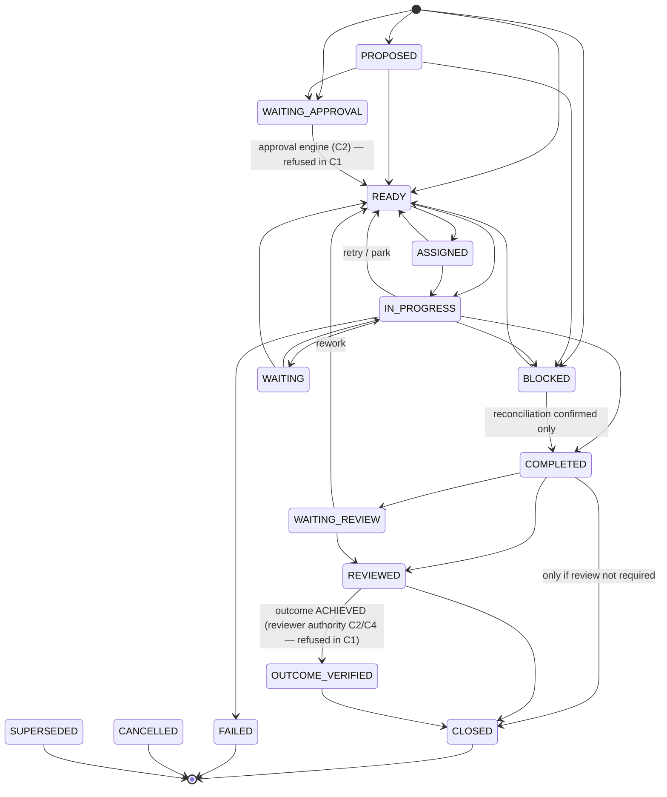

# C1 — Schema and State Model

**Status:** C1 implementation candidate — describes the code on this branch. Not a closure record.
**Schema version:** 3 (`packages/storage/migrations/0001_work_foundation.sql`,
`0002_queue_runs_artifacts.sql`, `0003_runtime_wake_generation.sql`). **Store:** SQLite (built-in `node:sqlite`, SQLite 3.53.x in Node
24.21) in WAL mode, one file: `<workspace>/state/company.sqlite3`.

## 1. Conventions that hold for every table

- **STRICT tables.** Column types are enforced.
- **Stable IDs.** UUIDv4 text (`crypto.randomUUID()`), `CHECK (length(id) = 36)`. IDs carry no
  business meaning.
- **One time representation.** Fixed-width ISO-8601 UTC with milliseconds (`2026-09-26T12:00:00.000Z`),
  enforced by a `GLOB` check. Lexicographic order = chronological order, so lease and due-time
  comparisons are plain `TEXT` comparisons. No local time zone is ever persisted.
- **Relational invariants in the datastore**: primary keys, foreign keys (`ON DELETE RESTRICT`, never
  cascade), `NOT NULL`, `UNIQUE`, `CHECK` (states, ranges, cross-column invariants) and partial
  unique indexes.
- **History is never erased.** `BEFORE DELETE` triggers abort deletes on every durable table.
  Append-only tables (`work_item_transitions`, `audit_events`, `run_checkpoints`,
  `backup_records`, `idempotency_records`) also abort updates.
- **JSON only for bounded, extensible metadata**: contributors, completion criteria, required evidence,
  processor input, checkpoint state, event payloads and audit details. Every JSON column is
  `json_valid`-checked and size-bounded. IDs, states, timestamps, claims and leases are always real
  columns. Writers refuse JSON keys that name credentials (`password`, `apiKey`, `accessToken`,
  `privateKey`, …). This is defense in depth, not proof that no secret exists.

## 2. Tables

| Table | Purpose | Key constraints |
|---|---|---|
| `schema_migrations` | applied migrations: version, name, SHA-256, runtime version, applied time | PK version; created by the migrator inside migration 1's transaction |
| `work_items` | canonical Work Item (Stage 8 §1) | root/parent lineage FKs; `lineage_depth` 0..32 and consistent with `parent_id`; state `CHECK`; `version` must rise by exactly one per update (trigger); identity and lineage columns immutable (trigger); terminal rows frozen (trigger); `BLOCKED ⇒ blocked_reason`; `OUTCOME_VERIFIED ⇒ outcome = ACHIEVED`; `SUPERSEDED ⇒ superseded_by`; one live row per `dedupe_key` (partial unique index) |
| `work_item_dependencies` | durable dependency edges | PK `(work_item_id, depends_on_id)`; `CHECK` no self-edge; reverse index for targeted wake; no delete |
| `work_item_transitions` | state history: from, to, version, reason code, opaque actor, correlation, causation, time | `UNIQUE (work_item_id, version)`; append-only |
| `idempotency_records` | `(scope, key)` → input fingerprint → result reference | PK `(scope, idem_key)`; immutable |
| `queue_jobs` | the durable queue | state `CHECK`; `CLAIMED ⇔ lease_owner, lease_expires_at, current_run_id` all set; `DEAD_LETTER ⇒ reason`; `attempt_count ≤ max_attempts ≤ 25`; one live job per Work Item (partial unique index); fencing token never decreases (trigger); final jobs frozen (trigger); claim-order index `(priority DESC, available_at, created_at, id) WHERE state='QUEUED'` |
| `runs` | one execution attempt by one worker | `UNIQUE (job_id, run_seq)`; one `RUNNING` run per job (partial unique index); `RUNNING ⇔ ended_at IS NULL`; finished runs are frozen (trigger); `retry_of_run_id` lineage |
| `run_checkpoints` | durable resumable progress | `UNIQUE (run_id, seq)`; state ≤ 64 KiB; SHA-256 of the canonical state JSON; append-only |
| `events` | durable outbox envelope | `id` unique; payload ≤ 2 KiB; the envelope is immutable and only `dispatched_at`/`dispatch_count` change; no delete |
| `audit_events` | content-minimized audit trail | details ≤ 1 KiB of short scalars; append-only |
| `runtime_instances` | one row per runtime process start: pid, versions, state, supervisor token, recovery summary | no delete |
| `runtime_leases` | singleton `supervisor` lease: holder, fencing token, expiry | a change of holder must raise the token (trigger); no delete |
| `runtime_wake` | durable wake generation (migration 3, D-C1-23): one row, one counter | `id = 1` only; the generation only increases (trigger); no delete; advanced by `queue_jobs` triggers in the same transaction as a job becoming `QUEUED`, its due time moving, or `cancel_requested` changing |
| `artifacts` | artifact metadata; content lives in the object store | SHA-256 hex check; identity/hash/size immutable (trigger); state `STAGED/READY/MISSING/CORRUPT/ABANDONED`; no delete |
| `backup_records` | backups produced from this store | append-only |

## 3. Work Item state machine

Source: `packages/domain/src/work-item.ts` (Stage 8 §3, §31, §34, §42). The table is explicit, and every
transition is validated by `assertTransition`. An invalid transition fails deterministically with
`INVALID_TRANSITION`; any transition out of a terminal state fails with `TERMINAL_STATE`.

Also allowed and omitted above for readability:
- `CANCELLED` and `SUPERSEDED` from every pre-completion state.
- `SUPERSEDED` from `COMPLETED`, `WAITING_REVIEW` and `REVIEWED`.
- `BLOCKED` and `WAITING` from `READY` and `ASSIGNED`.
- `WAITING_APPROVAL` from `READY` and `IN_PROGRESS`.
- `BLOCKED` from `WAITING`.
- `FAILED` from `WAITING` and `BLOCKED`.

Semantics that are preserved on purpose:
- **Work performed, completed, reviewed, outcome verified and closed are distinct states.** No
  `done` boolean exists. The outcome is a separate column (`NOT_ASSESSED`, `ACHIEVED`,
  `NOT_ACHIEVED`), so competent work whose outcome was not achieved closes as `NOT_ACHIEVED` (Stage 8
  §34).
- **Optional states stay optional.** Work that does not require review closes from `COMPLETED`.
  Review-required work moves to `WAITING_REVIEW` automatically on completion and cannot close
  before `REVIEWED`. `OUTCOME_VERIFIED` requires an `ACHIEVED` outcome.
- **Closing never records success (Stage 8 §34).** `ACHIEVED` is recorded only through
  `OUTCOME_VERIFIED`. The domain rule and a database trigger (`work_items_success_needs_verification`)
  both refuse `CLOSED`/`ACHIEVED` from any other state. A close may record `NOT_ACHIEVED` or leave the
  outcome `NOT_ASSESSED`.
- **Review is required at R2 and above (Stage 3 §2/§4)**, whatever the caller passes.
- **Fail-closed review.** Independent review must be enforced by authority (Stage 3 §4), and no
  reviewer authority exists until the Review Pool and permission engine (C2/C4). The manual API
  therefore refuses `REVIEWED` and `OUTCOME_VERIFIED` (`REVIEW_PATH_UNAVAILABLE`). Review-required work
  can wait in `WAITING_REVIEW` or return to rework, but C1 cannot make a record look reviewed.
- **Cancellation applies before completion; supersession applies until closure.**
- **Terminal states:** `CLOSED`, `FAILED`, `CANCELLED`, `SUPERSEDED`. A database trigger freezes
  terminal rows (no resurrection).
- **Fail-closed approval (Stage 1 §1, Stage 3 §3).** Work with `approval_required`, or at risk
  `R3`/`R4`, is created in `WAITING_APPROVAL` and can never be released to `READY`, `ASSIGNED` or
  `IN_PROGRESS`. Such an attempt throws `APPROVAL_PATH_UNAVAILABLE`, because no approval engine exists
  until C2.
- **Who drives which transition.** The runtime alone moves work into and out of `IN_PROGRESS`, and
  alone sets `WAITING`, `COMPLETED` and `FAILED`. The manual API (`transitionWorkItem`) covers
  `READY`, `ASSIGNED`, `BLOCKED`, `WAITING_REVIEW` and `CLOSED`; `REVIEWED` and `OUTCOME_VERIFIED`
  fail closed as above. It refuses executing work (`LEASE_HELD`), refuses any exit from
  `WAITING_APPROVAL` except cancellation and supersession (`APPROVAL_PATH_UNAVAILABLE`), and routes
  cancellation and supersession to their own APIs, which propagate. `WAITING_APPROVAL` is entered
  only by the creation gate, so no record can appear approved.
- **Actor references are opaque.** `owner_ref`, `actor_ref` and contributors are `<kind>:<id>`
  strings. C1 stores them verbatim and never claims they were authenticated or authorized.

## 4. Dependencies and lineage

- An edge is durable and never deleted. Self-edges are rejected by `CHECK` and in code
  (`DEPENDENCY_SELF`).
- A cycle is detected with a recursive CTE inside the same write transaction (`DEPENDENCY_CYCLE`).
- **When a dependency is satisfied** — D-C1-09 / D-C1-21, **Product Owner approved, C1 canonical**.
  Work that does not require review satisfies its dependents at `COMPLETED`, or later in the
  completed family. Work that requires review, including R2+ risk policy, satisfies them only at
  `REVIEWED` or later (Completed ≠ Reviewed). There is no separate `OUTCOME_VERIFIED` gating mode.
  C1 has no review authority, so review-required dependencies keep their dependents blocked in C1.
- Work with unresolved dependencies is `BLOCKED`, with `blocked_reason = DEPENDENCY` and
  `blocker_ref = work_item:<id>`. If a dependency ends as `FAILED`, `CANCELLED` or `SUPERSEDED`, the
  reason becomes `DEPENDENCY_FAILED` and the work stays blocked; it is never auto-cancelled.
- **Targeted wake.** Resolution touches only the dependents found through the reverse index. It
  happens in the same transaction as the completion, which unblocks and enqueues them.
- **Lineage.** `root_id`, `parent_id` and `lineage_depth` are immutable. Children inherit the root
  and the correlation ID. The structural depth ceiling of 32 is runaway protection, not the Stage 8
  delegation policy, which belongs to C4.

## 5. Queue, run and lease model

| Job state | Meaning |
|---|---|
| `QUEUED` | eligible once `available_at ≤ now`; claim order is priority DESC, available_at, created_at, id |
| `CLAIMED` | exclusively leased: `lease_owner`, `lease_expires_at`, `current_run_id`, `fencing_token` |
| `WAITING` | parked until an explicit wake (event-driven wait) |
| `RECONCILIATION_HOLD` | an uncertain side effect; never retried automatically |
| `DEAD_LETTER` | retries or interruptions exhausted; explicit operator requeue only |
| `DONE` / `FAILED` / `CANCELLED` | final and frozen |

| Run state | Meaning |
|---|---|
| `RUNNING` | the current attempt (at most one per job) |
| `SUCCEEDED` | processor completed |
| `PARKED` | processor chose to wait (`SAFE_TO_RESUME`) |
| `FAILED_RETRYABLE` / `FAILED_PERMANENT` | failure classified by the processor (or `RUN_TIMEOUT`/`PROCESSOR_ERROR` by the runtime) |
| `RECONCILIATION_REQUIRED` | ambiguous external outcome |
| `CANCELLED` | durable cancellation/supersession was finalized |
| `INTERRUPTED` | worker gone (crash, lease expiry, shutdown); `recovery_disposition` records `SAFE_TO_RESUME`, `SAFE_TO_RETRY` or `RECONCILIATION_REQUIRED` |

- `attempt` counts failed or interrupted attempts plus one. Waiting and graceful parking do not
  consume the retry budget.
- `run_seq` orders every run of a job. `retry_of_run_id` links a retry to the attempt it follows.

**Leases and fencing.**
- A claim increments the job's `fencing_token` and issues a fence `(jobId, runId, workerId, token)`.
- Every worker write (lease renewal, checkpoint, artifact attachment, settlement) must present its
  fence. It succeeds only while the job is `CLAIMED`, has the same token, owner and current run, and
  the lease has not expired. Otherwise it fails with `STALE_LEASE`, and that rejection is itself
  audited (`fencing.rejected`).
- Lease recovery bumps the token *before* anything else, so a paused worker is fenced even if no one
  has reclaimed the job yet.
- The supervisor lease works the same way: a singleton row with a monotonically increasing token.
  Every runtime claim transaction also checks that the claiming supervisor's lease is current
  (`SUPERVISOR_NOT_AUTHORITATIVE` otherwise).

## 6. Transaction boundaries

- Every mutating store method is **one** `BEGIN IMMEDIATE` transaction. The write lock is acquired up
  front, and a contended writer waits at most the bounded busy timeout (default 5 s), then fails with
  `STORAGE_BUSY`.
- A transaction callback is synchronous by type and checked at run time: returning a promise rolls
  back and throws `ASYNC_IN_TRANSACTION`. No code awaits inside a write transaction.
- **State + history + outbox event + audit row commit atomically.** For example:
  - creating executable work inserts the Work Item, its first transition, its job,
    `work_item.created` / `job.enqueued` events, an audit row and the idempotency record in one
    transaction;
  - completion ends the run, marks the job `DONE`, moves the item, resolves dependency edges,
    unblocks and enqueues only the affected dependents, and appends their events, all in one
    transaction.
- A rejected mutation (stale fence, idempotency or dedupe conflict) rolls back completely. Its audit
  row is written afterwards in a separate transaction.
- Multi-statement reads use a deferred transaction for a consistent WAL snapshot.
- SQL text is always a storage-internal constant, and every value is a bound parameter. List filters
  use `json_each(?)`, never string-built `IN (...)` lists.

## 7. Migration model

- **Ordered, immutable files.** The release pins every file by SHA-256 (CRLF-normalized) in
  `RELEASED_MIGRATIONS`, and the repository verifier re-checks the pins.
- **One transaction per migration.** Each migration runs inside `BEGIN IMMEDIATE` together with its
  `schema_migrations` row and `PRAGMA user_version`. A failure rolls back to the prior coherent
  version (`MIGRATION_FAILED`).
- **Startup refusals:**
  - an applied migration whose text changed (`MIGRATION_CHECKSUM_DRIFT`);
  - a `user_version` or applied version beyond the release (`SCHEMA_FROM_FUTURE`: no automatic
    downgrade);
  - a disagreement between `schema_migrations` and `user_version`.
- **Initial creation** goes through migration 1.
- **Verify-only mode.** Inspection tools open the store with `migrationMode: 'verify'`, so they
  never migrate underneath a live runtime.
- **Compatibility policy.** A newer runtime migrates an older database forward. An older runtime
  refuses a newer database. A backup snapshot is valid for restore when its version is ≤ the
  runtime's and its applied checksums match the pins.

## 8. Intentionally deferred

- **C2+ entities.** Employees, Departments, Directors, Models, Providers, Skills, Memory and Tools.
  C1 has opaque references only.
- **C2 governance.** Approval records and an approval engine, permission grants, budgets and cost
  events.
- **Stage 9 communication.** Messages, threads and requests.
- **Blocked ownership (Stage 8 §17).** C1 records the reason and the blocking reference
  (`blocked_reason`, `blocker_ref`). The resolver and the next unblock action belong with owner and
  escalation routing (C4).
- **Required-evidence enforcement (Stage 8 §30).** `required_evidence_json` is stored, and processor
  evidence is recorded on the run. Judging evidence completeness is review work (C2/C4); C1 does not
  claim it.
- **Later operational policy:**
  - recurring-responsibility schedules and overlap policy;
  - WIP limits per Employee or team (C1 has only the runtime-wide concurrency cap);
  - retention and rotation of events and audit rows.
- **Later schema features:**
  - an event schema registry beyond `version = 1`;
  - PostgreSQL portability, beyond keeping SQL inside one adapter.
